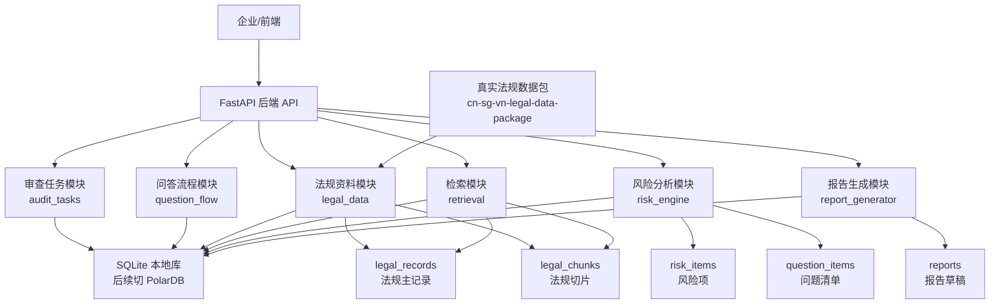
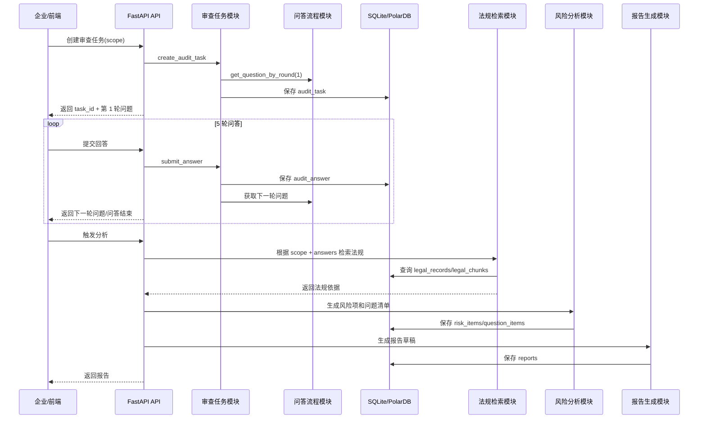
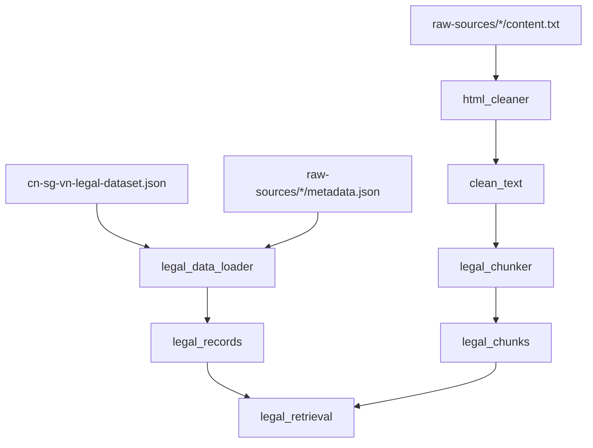
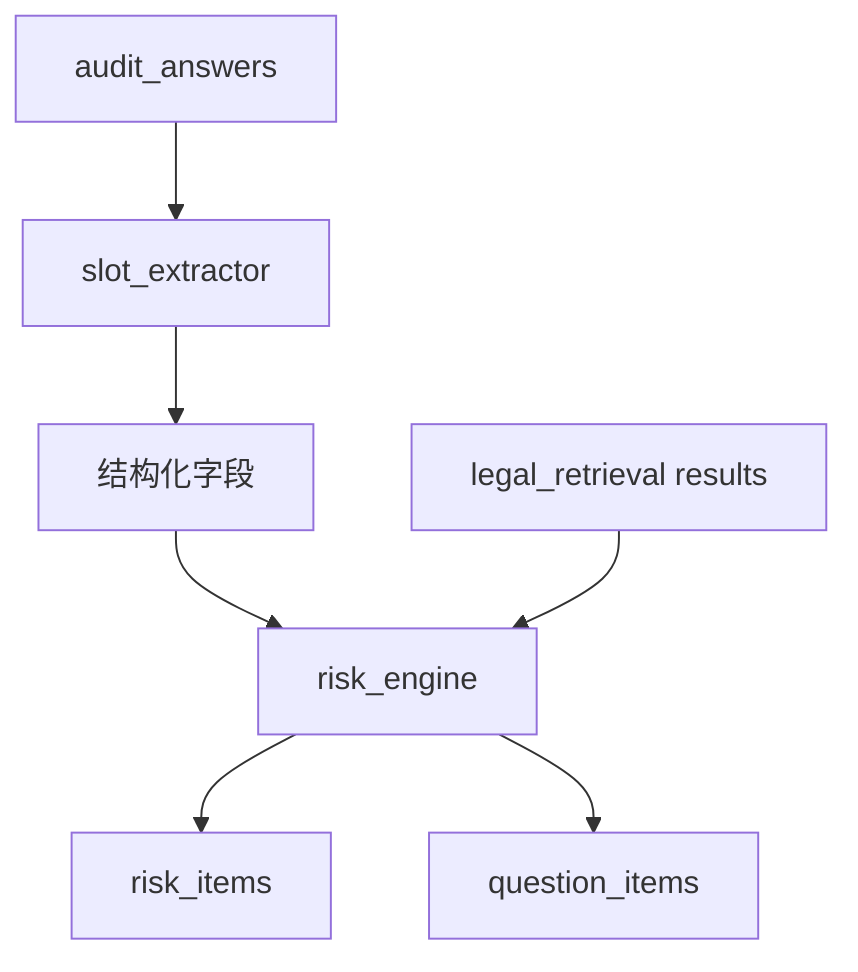
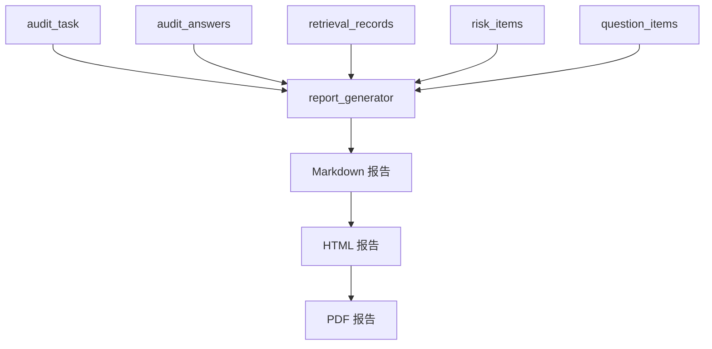

# 数据跨境合规体检智能体后端技术架构与实现步骤

版本：V0.1  
日期：2026-06-01  
定位：后端 MVP 技术设计与开发路线

## 1. 后端目标

本后端的核心目标不是先做完整企业管理系统，而是先跑通“数据合规体检智能体”的最小闭环：

1. 企业选择审查范围：中国、中国 + 新加坡、中国 + 越南。
2. 系统开启 5 轮问答，采集企业数据业务信息。
3. 系统保存问答记录。
4. 系统根据审查范围选择真实法规资料库。
5. 系统从法规库中检索相关法律依据。
6. 系统生成初步风险项。
7. 系统生成问题清单。
8. 系统生成体检报告草稿。
9. 后续再导出 PDF。

当前阶段优先实现“智能体业务闭环”，用户体系、复杂后台、权限体系和企业组织架构后置。

## 2. 后端总体架构图



## 3. 当前真实资料路径

真实数据包路径：

```text
D:\software\xwechat_files\wxid_ndm2d2zhsha012_549b\msg\file\2026-05\cn-sg-vn-legal-data-package\cn-sg-vn-legal-data-package
```

关键文件：

```text
cn-sg-vn-legal-dataset.json
index.csv
index.ndjson
schema.sql
retrieval-playbook.md
raw-sources
```

`raw-sources` 目录结构：

```text
raw-sources
  China
    cross_border_data
    enterprise_landing
    tax
  Singapore
    cross_border_data
    enterprise_landing
    tax
  Vietnam
    cross_border_data
    enterprise_landing
    tax
```

法规库三类：

1. `cross_border_data`：数据合规，MVP 第一优先级。
2. `enterprise_landing`：企业落地，MVP 第二优先级。
3. `tax`：税务合规，MVP 暂作为参考，不作为主要风险结论来源。

## 4. 后端模块划分

建议后端目录结构如下：

```text
backend
  main.py
  requirements.txt
  app
    api
      routes
        health.py
        audit_tasks.py
        legal_data.py
        reports.py
    db
      session.py
    models
      audit.py
      legal.py
      risk.py
      report.py
    repositories
      audit_task_store.py
      legal_store.py
      risk_store.py
      report_store.py
    schemas
      audit.py
      legal.py
      risk.py
      report.py
    services
      audit_scope.py
      audit_question.py
      legal_data_loader.py
      html_cleaner.py
      legal_chunker.py
      legal_retrieval.py
      slot_extractor.py
      risk_engine.py
      report_generator.py
```

## 5. 核心业务流程图



## 6. 数据库逻辑模型

### 6.1 当前已实现表

#### audit_tasks

保存一次体检任务。

核心字段：

```text
task_id
company_name
scope
countries
status
current_round
next_question
```

#### audit_answers

保存每轮问答回答。

核心字段：

```text
id
task_id
round_no
answer
```

### 6.2 下一阶段需要新增表

#### legal_records

法规主记录表，对应 `cn-sg-vn-legal-dataset.json` 的每一条法规。

建议字段：

```text
record_id
country
domain
law_title_local
law_title_en
citation
issuing_body
effective_date
is_currently_effective
official_url
agent_tags
retrieval_priority
raw_source_path
```

#### legal_chunks

法规切片表，对应清洗和切片后的法规正文片段。

建议字段：

```text
chunk_id
record_id
country
domain
chunk_no
chunk_title
chunk_text
chunk_summary
tags
source_url
```

#### retrieval_records

记录每次检索过程，方便追溯报告依据。

建议字段：

```text
id
task_id
query
scope
countries
matched_record_ids
matched_chunk_ids
created_at
```

#### risk_items

保存风险项。

建议字段：

```text
id
task_id
risk_title
risk_level
fact_summary
legal_basis
risk_description
suggestion
```

#### question_items

保存问题清单。

建议字段：

```text
id
task_id
question_title
question_description
required_material
priority
```

#### reports

保存报告草稿。

建议字段：

```text
id
task_id
report_title
report_status
markdown_content
html_content
pdf_file_url
```

## 7. 法规资料接入流程



实现顺序：

1. 先读取 `cn-sg-vn-legal-dataset.json`。
2. 将 29 条法规主记录导入 `legal_records`。
3. 再读取每条法规对应的 `metadata.json`。
4. 暂不直接把 HTML 原文用于检索。
5. 清洗 `content.txt`，生成纯文本。
6. 按国家规则切片：
   - 中国：按“第 X 条”。
   - 新加坡：按 Part / Section / Regulation。
   - 越南：按 “Điều”。
7. 切片结果进入 `legal_chunks`。

## 8. 检索逻辑

MVP 初期先做规则检索和关键词检索，不急着上向量库。

### 8.1 检索输入

来自任务和问答：

```text
scope
countries
answers
keywords
```

### 8.2 国家过滤

```text
china              -> China
china_singapore   -> China + Singapore
china_vietnam     -> China + Vietnam
```

### 8.3 领域过滤

优先级：

```text
cross_border_data > enterprise_landing > tax
```

MVP 报告主结论优先引用 `cross_border_data`。

### 8.4 标签/关键词

从用户回答中提取关键词：

```text
personal information
sensitive information
cross-border transfer
Singapore
Vietnam
recipient
consent
security measures
encryption
access control
```

中文对应：

```text
个人信息
敏感个人信息
数据出境
跨境传输
境外接收方
用户授权
告知同意
安全措施
加密
权限控制
```

### 8.5 检索输出

每条检索结果至少包含：

```text
record_id
country
domain
law_title_local
law_title_en
matched_text
source_url
match_reason
```

## 9. 风险分析逻辑



MVP 先用规则引擎，不先依赖大模型。

初始规则：

1. 涉及个人信息 + 跨境传输：至少中风险。
2. 涉及敏感个人信息：提高风险等级。
3. 境外接收方不明确：进入问题清单。
4. 未提到用户告知/同意：进入风险项。
5. 未提到数据处理协议：进入问题清单。
6. 未提到加密、权限控制、审计：进入整改建议。
7. 涉及 Vietnam / Singapore 时，必须检索目标国法规。
8. 无法规依据时，不生成确定性法律结论，只提示依据不足。

## 10. 报告生成逻辑

报告先生成 Markdown，后续再转 HTML/PDF。

报告结构：

```text
1. 报告标题
2. 免责声明
3. 企业基本信息
4. 审查范围
5. 问答摘要
6. 初步风险等级
7. 风险项
8. 问题清单
9. 法规依据摘要
10. 整改建议
11. 律师进一步确认事项
```

报告生成流程：



## 11. API 设计

### 已有/当前阶段接口

```text
GET  /api/v1/health
POST /api/v1/audit-tasks
GET  /api/v1/audit-tasks/{task_id}
POST /api/v1/audit-tasks/{task_id}/answers
```

### 下一阶段接口

```text
POST /api/v1/legal-data/import
GET  /api/v1/legal-data/records
GET  /api/v1/legal-data/records/{record_id}
POST /api/v1/audit-tasks/{task_id}/analyze
GET  /api/v1/audit-tasks/{task_id}/risks
GET  /api/v1/audit-tasks/{task_id}/questions
POST /api/v1/audit-tasks/{task_id}/reports
GET  /api/v1/reports/{report_id}
```

## 12. 实现步骤

### Step 1：保留当前已完成基础

当前已完成：

1. FastAPI 服务。
2. SQLite 本地数据库。
3. 审查任务创建。
4. 任务查询。
5. 5 轮问题配置。
6. 提交回答并推进轮次。

### Step 2：新增法规数据模型

新增文件：

```text
app/models/legal.py
app/schemas/legal.py
app/repositories/legal_store.py
```

先实现：

```text
legal_records
```

再实现：

```text
legal_chunks
```

### Step 3：读取真实法规主数据

新增文件：

```text
app/services/legal_data_loader.py
```

先读取：

```text
cn-sg-vn-legal-dataset.json
```

目标：

```text
导入 29 条 legal_records
```

### Step 4：接入法规导入 API

新增路由：

```text
app/api/routes/legal_data.py
```

接口：

```text
POST /api/v1/legal-data/import
```

作用：

```text
从本地真实数据包导入 legal_records
```

### Step 5：实现基础检索

新增文件：

```text
app/services/legal_retrieval.py
```

先实现：

```text
按 countries 过滤
按 domain 过滤
按关键词匹配 law_title / agent_tags
```

### Step 6：实现风险分析

新增文件：

```text
app/services/risk_engine.py
```

输入：

```text
audit_task
audit_answers
retrieval_results
```

输出：

```text
risk_items
question_items
```

### Step 7：实现报告草稿

新增文件：

```text
app/services/report_generator.py
```

先输出 Markdown：

```text
report.markdown_content
```

后续再加：

```text
HTML
PDF
```

## 13. 当前优先级

立刻做：

1. `legal_records` 表。
2. `legal_data_loader.py`。
3. `/api/v1/legal-data/import`。
4. 从真实数据包导入 29 条法规。
5. 简单检索接口。

暂缓做：

1. 登录注册。
2. 企业管理后台。
3. 复杂权限。
4. PDF 样式。
5. 向量数据库。
6. 大模型 Agent。

## 14. 技术判断

当前阶段应该采用：

```text
FastAPI + SQLAlchemy + SQLite
```

后续切换：

```text
SQLite -> PolarDB PostgreSQL 兼容版
```

原因：

1. 本地开发先跑通业务闭环。
2. SQLAlchemy 降低后续换库成本。
3. 真实法规数据包已有 PostgreSQL 导入参考。
4. 检索和切片成熟后，再评估向量服务。

## 15. 一句话总结

后端 MVP 的主线不是“后台管理系统”，而是“问答采集 + 真实法规库检索 + 风险分析 + 体检报告”的智能体业务闭环。当前已经完成任务和问答基础，下一步应立即接入真实法规数据包，先把 29 条法规主记录导入本地数据库，再逐步做正文清洗、切片、检索、风险和报告。

